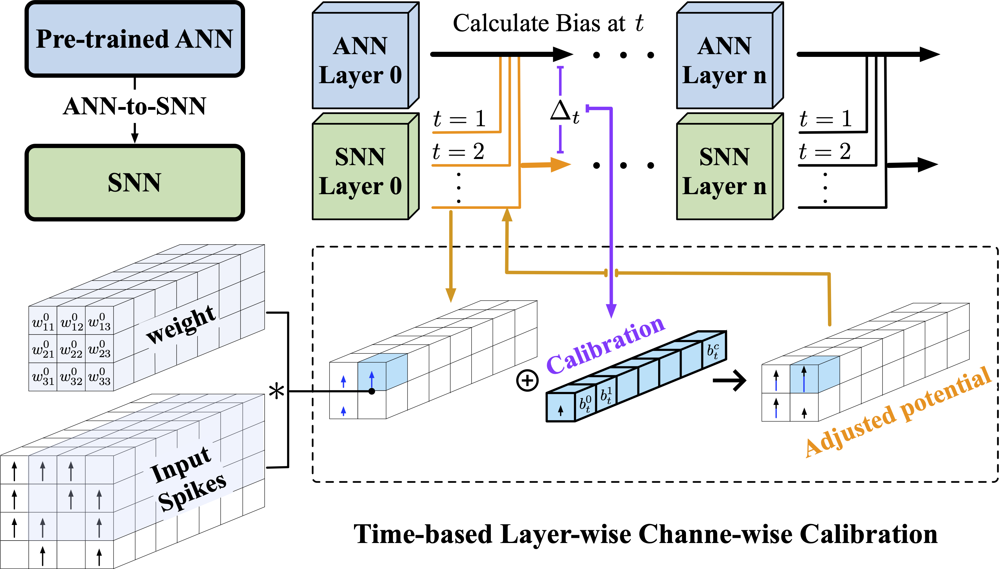

# FTBC: Forward Temporal Bias Correction for Optimizing ANN-SNN Conversion

[[ECCV 2024](https://eccv2024.ecva.net/)] [[Paper](https://arxiv.org/abs/2403.18388)] [[Poster](./docs/ECCV_2024_poster.pdf)]

This repository contains our implementation of FTBC, along with several baseline methods related to ANN-SNN conversion. Below is an overview of our proposed method.

<p align="center">
    
</p>

### Running Experiments

To run the experiments for each baseline, navigate to the `run_scripts` folder located under the respective baseline directories. Instructions for running each experiment are provided within.

### Citation

If you find this repository useful, please consider citing our paper:

```bibtex
@inproceedings{wu2024ftbc,
  title={FTBC: Forward Temporal Bias Correction for Optimizing ANN-SNN Conversion},
  author={Wu, Xiaofeng and Bojkovic, Velibor and Gu, Bin and Suo, Kun and Zou, Kai},
  booktitle={European Conference on Computer Vision},
  year={2024}
}
```
